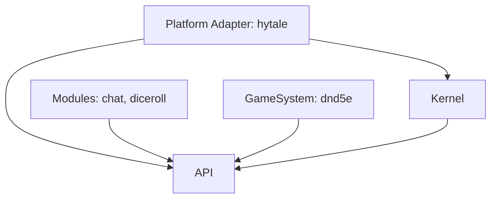

# Project Architecture Blueprint: VTTale

This document provides a comprehensive overview of the VTTale architectural framework, documenting its design principles, core components, and implementation patterns. VTTale is an extensible, platform-agnostic, "headless" Virtual Tabletop (VTT) engine designed to integrate seamlessly into host game engines.

## 1. Architectural Overview

VTTale utilizes a **Micro-kernel / Plug-in Based / Hexagonal** architecture. The design is heavily inspired by FoundryVTT but adapted for a headless, Java-based environment.

### Core Principles:
- **Platform Agnosticism**: The core engine is decoupled from any specific game engine, interacting through adapters.
- **Strict Dependency Flow**: Dependencies flow towards the `api` module, ensuring a clean separation of concerns.
- **Event-Driven Communication**: Components interact asynchronously and loosely via a type-safe event bus.
- **Modular Extensibility**: New features and game systems are added as self-contained modules discovered via Java SPI.

---

## 2. Architecture Visualization (C4 Model)

### Level 1: System Context
- **VTTale Core**: The headless engine managing rules, dice, and state.
- **Platform (e.g., Hytale)**: The host game engine providing the UI, world, and networking.
- **User (Player/GM)**: Interacts with VTTale through the host game's chat and command systems.

### Level 2: Containers (Modules)
- **API**: The shared contract defining interfaces and data structures.
- **Kernel**: The execution engine managing lifecycle and communication.
- **Modules/GameSystems**: Plugins implementing specific features or RPG rules.
- **Adapters**: Bridges translating host game events into VTTale events.

---

## 3. Core Architectural Components

### 3.1 API Module (`org.vttale.vttale.api`)
- **Purpose**: Defines the "Contract" for the entire system.
- **Key Responsibilities**:
    - Providing core interfaces: `Kernel`, `EventBus`, `Module`, `CommandRegistry`.
    - Defining standard events: `CommandExecutedEvent`, `RegisterCommandRequest`.
    - Routing metadata: `EventContext`.
- **Patterns**: Interface Segregation, Observer (interfaces), Context Object.

### 3.2 Kernel Module (`org.vttale.vttale.kernel`)
- **Purpose**: Implements the core services and manages the plugin lifecycle.
- **Key Responsibilities**:
    - **Service Discovery**: Uses `ServiceLoader` to find and load `Module` implementations.
    - **Event Dispatching**: Implements a `SimpleEventBus` using `ConcurrentHashMap` and thread-safe listeners.
    - **Command Management**: Provides a centralized `SimpleCommandRegistry`.
- **Patterns**: Micro-kernel, Service Locator (via SPI), Singleton (exposed via `VTTale` class).

### 3.3 Platform Adapters (`org.vttale.vttale.platform.*`)
- **Purpose**: Bridges the gap between VTTale and specific game engines.
- **Key Responsibilities**:
    - Bootstrapping the VTTale kernel.
    - Mapping native game commands to VTTale's `CommandExecutedEvent`.
    - Handling `PlatformBroadcastEvent` to display messages in the game's UI.
    - Implementing game-specific logic (e.g., Hytale pathfinding, entity management).
- **Patterns**: Adapter, Facade.

---

## 4. Architectural Layers and Dependencies

The dependency graph is strictly hierarchical to prevent leaks and circularities:

| Layer | Responsibility | Allowed Dependencies |
| :--- | :--- | :--- |
| **Platform** | Bridge to host engine | `api`, `kernel`, `module` (runtime) |
| **Kernel** | Engine implementation | `api` |
| **Modules** | Feature logic | `api` |
| **API** | Shared contracts | None |

---

## 5. Service Communication Patterns

### 5.1 Type-Safe Event Bus
Communication occurs via the `EventBus`. Modules never call each other directly.
- **Publishing**: `kernel.getEventBus().publish(event, context)`
- **Subscribing**: `kernel.getEventBus().subscribe(EventType.class, (event, context) -> { ... })`

### 5.2 Dynamic Command Registration (Catch-Up Pattern)
Because modules and adapters load at different times, VTTale uses a "Catch-Up" pattern:
1. **Registration**: Modules register commands in `CommandRegistry`.
2. **Notification**: Kernel publishes `RegisterCommandRequest`.
3. **Catch-Up**: When an adapter enables, it reads `getRegisteredCommands()` to register anything it missed and then listens for future requests.

---

## 6. Implementation Patterns

### 6.1 Module Lifecycle
Modules are discovered via Java's SPI (`META-INF/services`).
- `onEnable(Kernel kernel)`: Entry point for registration and subscription.
- `onDisable()`: Cleanup hook.

### 6.2 Event Routing (`EventContext`)
Every event includes an `EventContext` containing:
- `senderId`: The UUID of the player, "CONSOLE", or "KERNEL" (for kernel-originated events).
- This allows platform adapters to route responses back to the correct originator.

---

## 7. Extensions and Evolution

### Adding a New Feature
1. Create a new module or system.
2. Implement the `Module` interface.
3. Register the class in `META-INF/services/org.vttale.vttale.api.module.Module`.
4. Register your commands and subscribe to your events in `onEnable`.

### Adding a New Platform
1. Create a new platform adapter.
2. Bootstrap VTTale in the engine's initialization hook.
3. Subscribe to `RegisterCommandRequest` to map VTTale commands to the engine's command system.
4. Subscribe to `PlatformBroadcastEvent` to map VTTale messages to the engine's chat system.

---

## 8. Architectural Decision Records (ADR)

### ADR 001: Java SPI for Module Discovery
- **Decision**: Use `java.util.ServiceLoader` instead of a custom JSON manifest system.
- **Rationale**: Leverages standard Java mechanisms, simplifies classpath handling, and provides type-safety during loading.
- **Consequence**: Modules must provide a service file in `META-INF`.

### ADR 002: Headless Architecture
- **Decision**: Decouple the UI entirely from the VTT core.
- **Rationale**: Allows VTTale to run in various engines with radically different UI systems (2D, 3D, chat-only).
- **Consequence**: All visual elements must be handled by platform adapters.

### ADR 003: Simple Event Bus
- **Decision**: Use a synchronous, thread-safe implementation of an event bus.
- **Rationale**: Keeps implementation simple while allowing for asynchronous execution if handlers choose to spawn tasks.
- **Consequence**: Handlers should avoid blocking the bus if possible.

---

*Generated on: 2026-01-23*
*Architectural Blueprint Version: 1.0.0*
